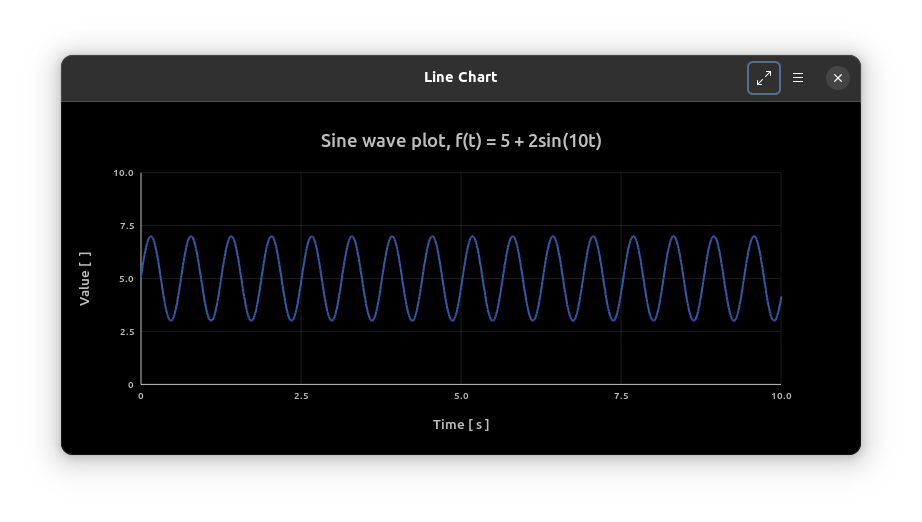
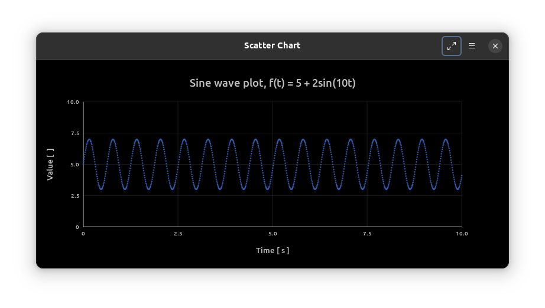
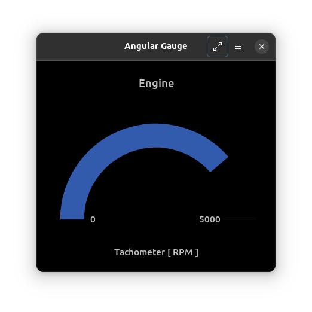
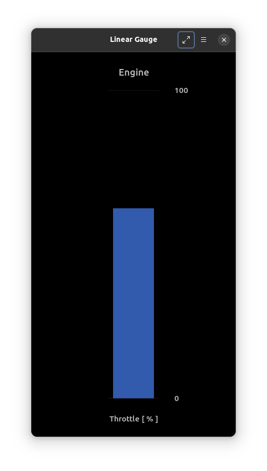
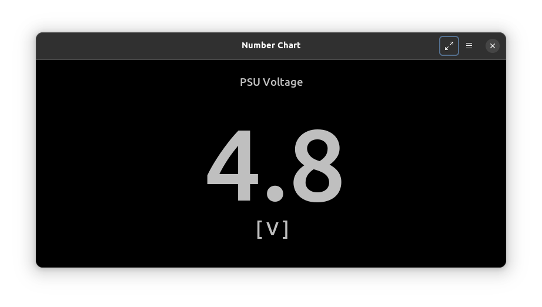

# GtkChart - a chart widget for GTK4

## Introduction

The beginnings of a small chart widget library for GTK4.

This is a spinoff from the [lxi-tools](https://lxi-tools.github.io) project.

Much can be improved but it is better than nothing.

Looking for maintainer/contributors to help improve this library.

## Motivation

Couldn't find a chart widget library for GTK4 so created one.

## Features

 * Various chart types
   * Line
   * Scatter
   * Linear gauge
   * Angular gauge
   * Number
 * Dimensionally scalable
 * Plot and render data live
 * Save rendered chart to PNG
 * Save plotted data to CSV
 * Demo application

## Todo

 * Optimize Cairo/snapshot code
 * Make charts handle negative axis ranges
   * Introduce gtk\_chart\_set\_x\_min()
   * Introduce gtk\_chart\_set\_y\_min()
 * Make charts zoomable
 * Make chart axes autoscale depending on plot value
 * Make colours configurable
 * Etc.

## Usage

```
#include <gtk/gtk.h>
#include <gtkchart.h>
...
// Required for GtkChart to be recognized by builder
gtk_chart_get_type();
...
GtkChart *chart = GTK_CHART(gtk_chart_new());
gtk_chart_set_type(chart, GTK_CHART_TYPE_LINE);
gtk_chart_set_title(chart, "Title");
gtk_chart_set_label(chart, "Label");
gtk_chart_set_x_label(chart, "X label [ ]");
gtk_chart_set_y_label(chart, "Y label [ ]");
gtk_chart_set_x_max(chart, 100);
gtk_chart_set_y_max(chart, 10);
gtk_chart_set_width(chart, 800);
...
gtk_chart_plot_point(chart, 0.0, 0.0);
gtk_chart_plot_point(chart, 1.0, 1.0);
gtk_chart_plot_point(chart, 2.0, 2.0);
gtk_chart_plot_point(chart, 3.0, 3.0);
...
gtk_chart_save_csv(chart, "chart0.csv");
gtk_chart_save_png(chart, "chart0.png");
```

See the [demo application](demo/gtkchart-demo.c) for more details.

## Chart Types

<p align="center">





</p>

